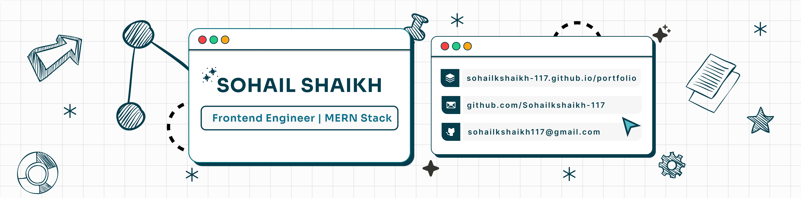

  

# Hi, I'm Sohail 👋

- 🖥️ Frontend engineer focused on building scalable React applications
- 🔧 Building towards full-stack systems — Node.js, Express, MongoDB
- 🧠 I enjoy building things that are well-structured and visually intentional
- 🚀 Currently building: Structured Notes Management API (focused on modular architecture & data relationships)
- 💼 Open to frontend and MERN stack opportunities
- 📫 Reach me at: sohailkshaikh117@gmail.com

---

## 🛠 Tech Stack

**Frontend**

**UI & Styling**

**Backend**

**Tools & Platforms**

---

## 🔗 Links

